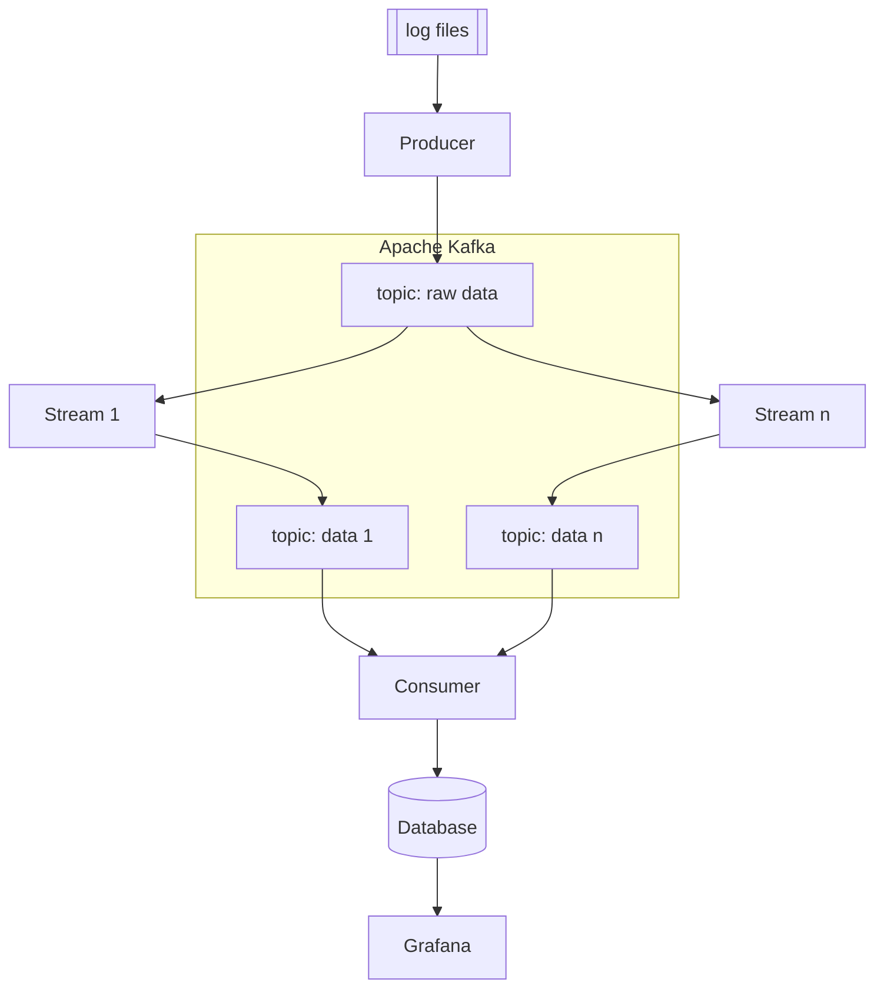

# <div align="center">Log files Analysis with Kafka</div>

## <div align="center">Showcase</div>

## Introduction
This showcase shows conceptual how log data can be analysed that are generated by
hardware and software components, e.g. network, operating systems, 
applications, and servers. The following technology stack is used:

- Apache Kafka as a distributed event streaming platform
- Microservices with Spring Boot  
- SQL database 
- Grafana dashboard 
- Producer application that publishes the raw log data into Kafka.
- Microservice applications consume the raw data as streams, analyses and aggregates them 
  into valuable information and publishes the aggregated
  information again into Kafka.
- Consumer application consumes the aggregated information from Kafka
  and writes them into a SQL database.
- Grafana dashboard visualizes the data from the database. 

The following flow chart shows this concept:



## Example 
System daemons, the kernal and custom applications emit operational
data that is logged in files on disks. These files are often difficult
to read and need to be summarized, filtered and aggregate to monitor
what is happened in the system.

These PoC demonstrates how such system log files can be managed by 
a set of microservices that run in an apache kafka cluster.
The analyzed data is stored in a MariaDB database. The monitoring takes
place in a Grafana dashboard that shows the time-lined data tabular and 
graphical.

The demonstrator shows an exemple with the
<b>/var/log/auth.log</b> file used on Ubuntu and related systems.
In this file two types of data are logged: Successful and
failed logins.

Example log entry of a successful login:
   ```bash
Jun 17 07:07:00 combo ftpd[29504]: connection from 24.54.76.216 (24-54-76-216.bflony.adelphia.net) at Fri Jun 17 07:07:00 2005 
   ```

Example log entry of en failed login:
   ```bash
Jun 15 20:05:31 combo sshd(pam_unix)[24140]: authentication failure; logname= uid=0 euid=0 tty=NODEVssh ruser= rhost=d211-116-254-214.rev.krline.net 
   ```

Repeated failed login attempts on a Linux server can indicate that someone
is trying to break into an account or might only mean that someone forgot their password or is mistyping it.


## Requirements

---

## Running the application
### Running Kafka as Docker container
Open a terminal and run the docker container via the docker compose file.
   ```bash
   cd docker/kafka
   docker compose up -d
   ```
This starts the zookeaper and the kafka broker at localhost:9092.

In order to check the communication a kafka consumer console can be started:
 ```bash
   docker run --net=host confluentinc/cp-kafka kafka-console-consumer --bootstrap-server localhost:9092 --topic log-raw-data --from-beginning --group syslog-kafka
   ```
The command is defined in the shell script docker/kafka/kafka-consumer-console.sh.

### Running the Syslog-Kafka-Producer
The application syslog-kafka-producer can be started as follows:
 ```bash
   docker run --net=host -p 8080:8080 syslog-producer
   ```
This application is a Spring Boot Application with a REST API.

   ```bash
   curl -X POST localhost:8080/producer/upload --form 'file=@data/Linux_2k.log'
   ```

   ```bash
   curl -X POST localhost:8080/producer/message --form 'content=Hallo World!'
   ```

### Running MariaDB and Grafana as Docker container

