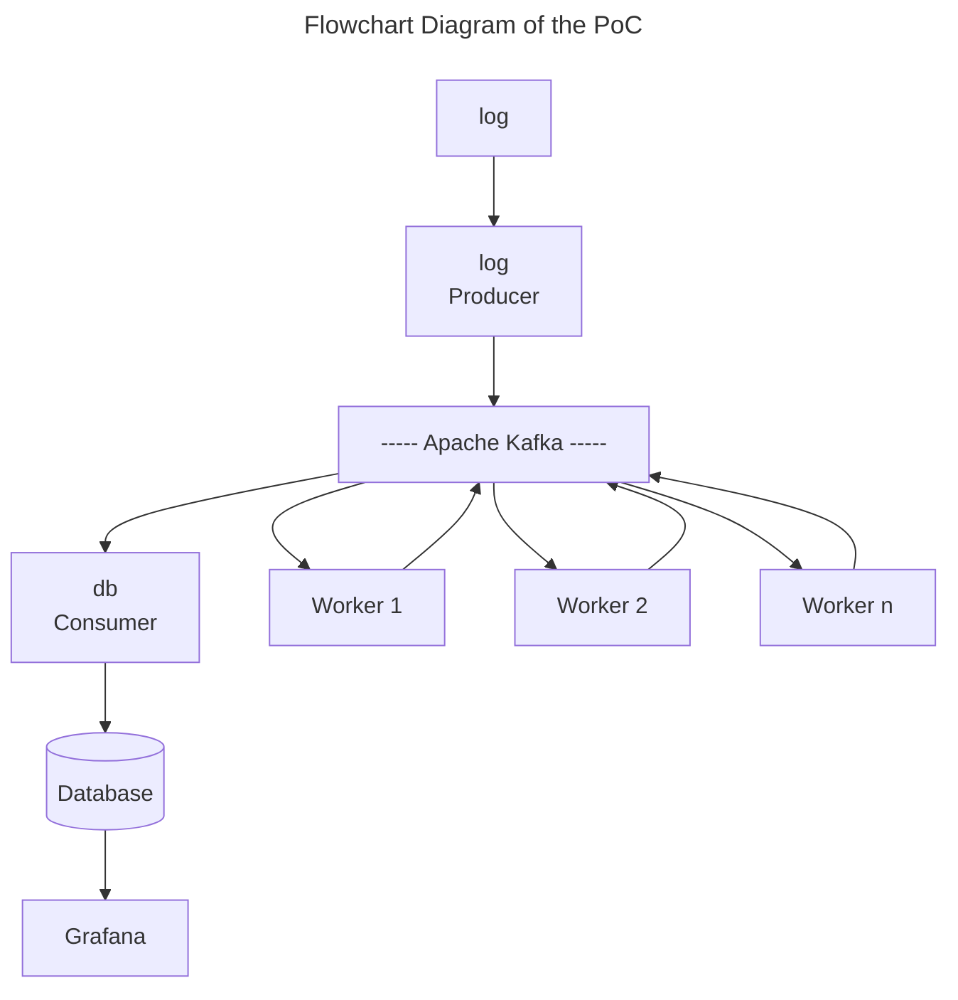

# <div align="center">Linux Log files Analysis with Kafka</div>

## <div align="center">Proof of concept</div>

## Introduction
System daemons, the kernal and custom applications emit operational
data that is logged in files on disks. These files are often difficult
to read and need to be summarized, filtered and aggregate to monitor
what is happened in the system.

These PoC demonstrates how such system log files can be managed by 
a set of microservices that run in an apache kafka cluster.
The analyzed data is stored in a MariaDB database. The monitoring takes
place in a Grafana dashboard that shows the time-lined data tabular and 
graphical.



The demonstrator shows an exemple with the
<b>/var/log/auth.log</b> file used on Ubuntu and related systems.
In this file two types of data are logged: Successful and
failed logins.

Example log entry of a successful login:
   ```bash
Jun 17 07:07:00 combo ftpd[29504]: connection from 24.54.76.216 (24-54-76-216.bflony.adelphia.net) at Fri Jun 17 07:07:00 2005 
   ```

Example log entry of en failed login:
   ```bash
Jun 15 20:05:31 combo sshd(pam_unix)[24140]: authentication failure; logname= uid=0 euid=0 tty=NODEVssh ruser= rhost=d211-116-254-214.rev.krline.net 
   ```

Repeated failed login attempts on a Linux server can indicate that someone
is trying to break into an account or might only mean that someone forgot their password or is mistyping it.


## Requirements

---

## Running the application

### Running Kafka

1. Open a terminal and start the zookeeper service.
   ```bash
   bin/zookeeper-start.sh
   ```
1. Open a terminal and start the kafka service.
   ```bash
   bin/kafka-start.sh
   ```

### Running MariaDB and Grafana as Docker container

### Running

   ```bash
   curl -X POST localhost:8080/producer/upload --form 'file=@data/Linux_2k.log'
   ```

   ```bash
   curl -X POST localhost:8080/producer/message --form 'content=Hallo World!'
   ```

